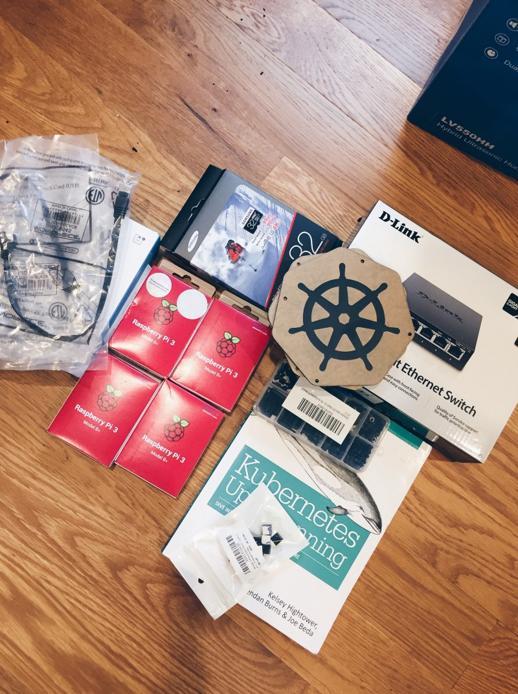

# Hardware

Below is a list of the hardware that was kindly provided by Lunar Ops, Inc for the Kubernetes Raspberry Pi Cluster.

| Qty | Item | Description |
| --- | --- | --- |
| 4 | [Raspberry Pi 3 B+]() | |
| 4 | [32GB Samsung Pro Plus Micro SDHC card]() | Used for boot drives |
| 4 | [1-ft Cat5e ethernet cable]() | |
| 4 | [128 Samsung USB 3.1 Flash Drive]() | Used for persistent storage |
| 1 | [D-Link 5 Port Gigabit Unmanaged Metal Desktop Switch (DGS-105) Black]() | This was later changed to the Ubiquiti EdgeRouter X. Ubiquiti EdgeRouter X - The router. This provides the Kubernetes cluster with DHCP server |
| 1 | [Anker PowerPort 6 (60W 6-Port USB Charging Hub) with 6 pack Premium 1ft Micro USB]() | Use to provide power to the Raspberry Pi |
| 1 | [8 Piece Black Aluminum Heatsink for Raspberry Pi 3]() | This helps to reduce the head generated on the microchip surface |
|  1 | Custom laser cut black arcylic | *Optional:* by [Fabberz NYC](https://www.fabberz.com/) (and template by [Kasper Nissen](https://twitter.com/phennex)) |
